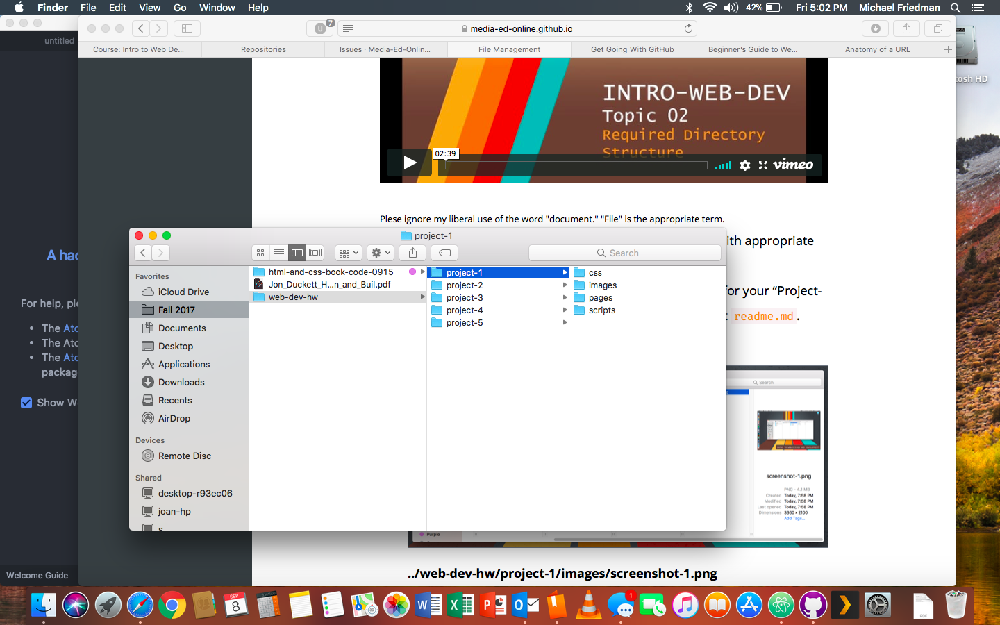

# My First README.md
## By Michael Friedman

---

### Let's Start!

First of all, direct your attention to this amazing screenshot taken on my lovely computer!

*Great Screenshot - Michael's Computer (2017)*


Now that you've seen my super awesome screenshot, let's move onto other matters!

---

### Issues

So now let's talk about some of the issues I've been having with GitHub

1. I felt pretty ashamed that it was not easy for me, as I come from a technology background.
2. It was difficult trying to figure out what assignment was actually due at the time because it was on both Moodle **AND** GitHub.
3. I didn't even realize that there were additional topics on the website, besides the introduction, for a few days. (website is located [here](https://media-ed-online.github.io/intro-web-dev))


---

### Good Things

Since it seems like you are still here, let me now talk about the good things!

- Now that I have successfully figured out how things work, they work great!
- Reaching out to the instructor was easy to do, and produced results **FAST**.
- I learned that I was *NOT* alone in my beginning frustrations.
- I think this class is going to be fun!
- I realized that markdown is similar to the formatting settings on [Reddit's](http://www.reddit.com) website.

---

### Summary

All in all, now that I have things sorta-kinda figured out, I feel like I am going to thoroughly enjoy this class. I have always had an interest in coding and programming, and since I am still an *undeclared* student, this class is making me consider it as a career choice.

I've just tried the commit feature with the Version Control System. I rather enjoy the fact that you can go back and see the changes made.

---

### BONUS FEATURES

I remember as a kid I had a really cool "computer" that I got as a gift. It was a learning-type system and it taught you how to code in **BASIC**.

Here is a simple line that is often used in computer programming in some form:

```
10 Print "Hello World"
```

---

HEHEHEHE, I added this to check commits :)

---

### Wayback Machine Experiences

I **LOVED** using the Wayback Machine. I looked at several sites to see how they have progressed. The main theme across all these websites seems to be basic text and low-resolution photos. This was most likely due to the fact that the majority of people used dialup internet during the 20th Century.

1. [Facebook](http://www.facebook.com) was interesting to look at. It started off as a colleague and business type service, sort of like LinkedIn.
2. [Ask Jeeves](http://www.askjeeves.com), now known as "Ask.com". I remember using Ask Jeeves when I was younger. This was before Google was popular.
3. [Dogpile](http://www.dogpile.com) was another search engine that I used as a kid. It's very interesting to see how sites have more pictures and smoother fonts.
4. The computer store I work for, [ReCompute Computers](http://www.recomputecomputers.com) is actually pretty funny. For a tech company, we have a really basic website that is primarily used for hours of operation. I am hoping that this class can teach me the skills needed to update this site to the modern age!
5. Another site I chose to explore was [the City of Missoula's website](http://ci.missoula.mt.us). Again, there was a lack of images, and mostly just text with some low-quality buttons.

---
