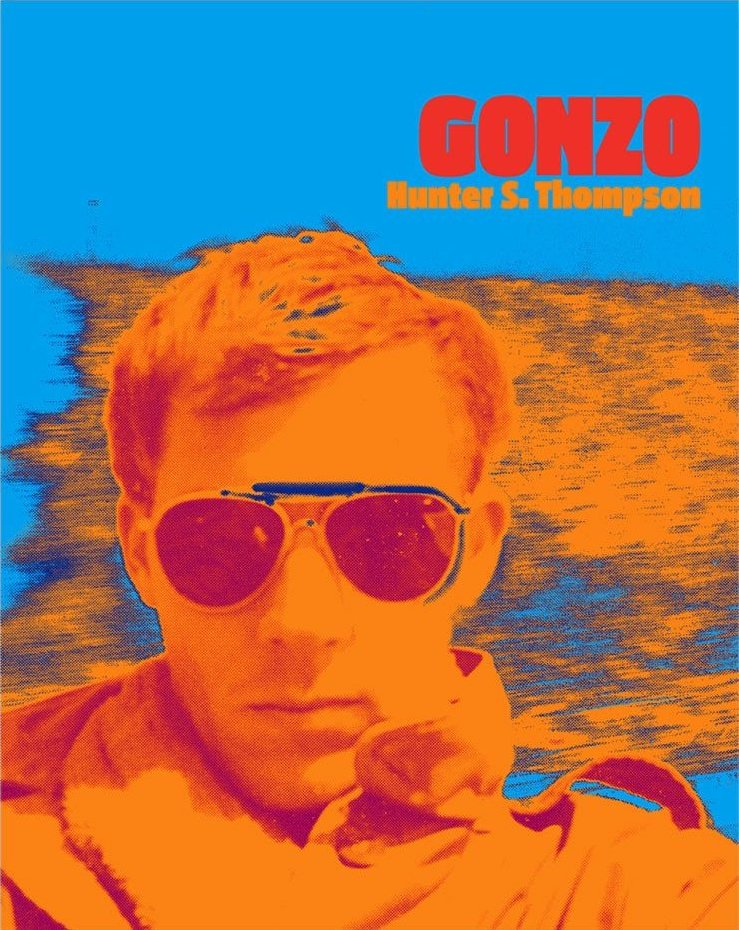

# Project 3 readme.md
## By Michael Friedman

---

### Let's Start!

## CSS

I really **Love** being able to make a whole style sheet seperate from the HTML document to put everything on regarding color and other styles. This will make html pages look a lot easier to read and cleaner code. **EXCITING!**

The many selector options are a little overwhelming. I don't think I'll be able to memorize all of them, but I'll certainly know a few by name. This is going to make our pages look a lot better with much less time spent individually styling elements.

## Project 3:

I am unsure what I want to do this project on yet. Still trying to decide and I don't have much time left.
1. I have decided to do a blog post style page. It will be nice to be able to incorporate paragraphs with borders around them.
2. I think I have decided to do a page using the original article posted in the Rolling Stones *Fear and Loathing in Las Vegas* by Hunter S. Thompson in 1971.
3. I will be citing the [rolling stones page](http://www.rollingstone.com/politics/news/fear-and-loathing-in-las-vegas-19711111?print=true)
4. I am going to be using a color scheme based off the movie poster  or off the cover of his book, Gonzo. 
5. Colors that I may use:
``#009FEC`` ``#FB8215`` ``#EF3028`` ``#C1DDF2``
6. I am thinking of using either [Kalem or Open Sans Condensed Font](https://fonts.googleapis.com/css?family=Kalam|Open+Sans+Condensed:300) font packs from Google.

## Colors:

I chose my color pallet based off the colorized photo used on the cover of the book *"Gonzo"*. These colors seem to be a theme among Hunter S. Thompson's photos and art. The movie poster for "Fear and Loathing in Las Vegas" also has similar colors. On top of this, I believe it looks really good when I compliment these colors on my page.

## OOPS!

OK so as usual, I might have gone ahead and done some things that weren't supposed to be done yet.

I created a basic menu at the top with styled links that look like buttons and created almost all the content for the site. I need to start reading the homework section more. :)

## Needed help

I was extremely overwhelmed by this project. I strive for perfection and I put probably 18 hours into this page. I finally had to contact the instructor because I was in the middle of changing jobs as well as balancing life and school. Luckily for me she helped me tremendously by creating a menu stylesheet and a new navigation menu. I applied some touches to it and placed it on each page. Now I am ready to sleep this entire weekend.

# END
